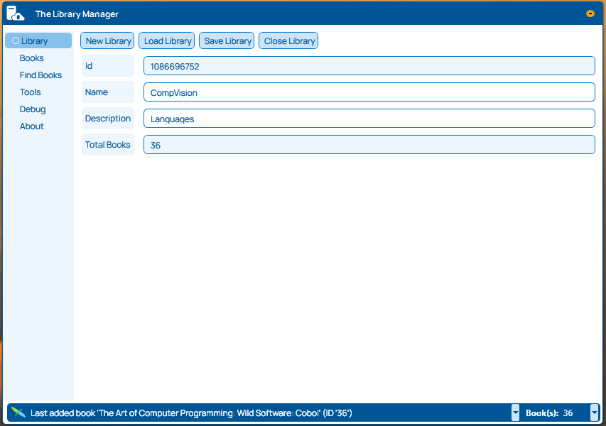

# Library Manager

**Library Manager** is a comprehensive application designed to help users efficiently catalog, organize, and manage their personal or institutional book collections. With features such as ISBN scanning, detailed book information storage, and lending management, it serves as an essential tool for book enthusiasts and librarians alike.

## Features

- **Comprehensive Book Details** - Store and view information such as title, author, genre, publication date, and more.
- **Search and Filter** - Easily find books in your collection using various search criteria and filters.
- **Customizable Categories** - Organize your books into categories that suit your preferences.

## Installation

1. **Clone the Repository:**
   ```sh
   git clone https://github.com/ryik5/BookLibraryManager.git
   cd BookLibraryManager/LibraryManager
   ```

2. **Install Dependencies and Resources:**
   Ensure you have the required dependencies, libraries and resources installed.
   
   2.1 build .dll in BookLibraryManager.Common 
   
   2.2.1 build .dll in BookLibraryManager.XmlFileLibraryOperator
   
   or
   
   2.2.2. build your own providers and modify LibraryManager code to work with other kind of library's storages.
   
   2.3 add external icon/logo in project to customise the application

   2.4. build **LibraryManager**

4. **Run the Application:**
   ```sh
   [command_to_run_application]
   ```

## Usage

### Adding Books
- Navigate to the **'Add Book'** section.
- Scan the book's ISBN or enter the details manually.
- Attach additional data
- Click **'Save'** to add the book to your collection.

### Searching for Books
- Use the **search bar** at the top to enter keywords.
- Use **search-on-fly** to search books while inputting a part of keyword.
- Apply **filters** to narrow down results by author, genre, or status.

## Screenshots


*The main dashboard displaying an overview of your collection.*

![Books View]Images/bookdetails.png)
*The 'Books view' interface.*

![Add Book]Images/addbook.png)
*The 'Add Book' interface with ISBN scanning feature.*


*Find books in your library and check them.*

## License

This project is licensed under the [MIT License](link_to_license).

## Contact

For questions or support, please contact **me** at **github**.

